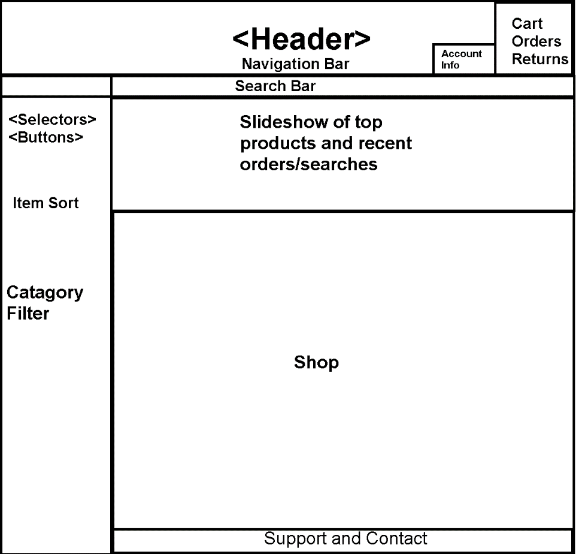

##  App
Quick Fix

## Table of contents
* [How it works](#how-it-works)
* [API's](#apis-used)
* [WireFrame](#wireframe)
* [Preview](#preview)
* [Flashcard](#flashcard-page)
* [Functions](#functions)
* [Future Features](#future-features)
* [Collaborators](#collaborators)

## How it Works


## APIs Used
-
-
-
## WireFrame


Our original wireframe includes a header, aside, and body section.
For this Project we will be using these three main front end languages HTML, CSS, JavaScript
- HTML - this is the markup language for our document to be displayed on the web browser
- CSS - this is the language we use to style an HTML document as well as describes how HTML elements should be displayed.
- JavaScript - this  is a scripting language that enables you to create dynamically updating content, control multimedia, animate images, and pretty much everything else

## Preview
![screenshot]

# Flashcard Page

## Functions
![screenshot]
![screenshot]
![screenshot]
![screenshot]
![screenshot]
![screenshot]

## Latest Development Changes
```
git clone 
```

## Future Features
With this project we would like to expand our scope beyond the topics we have covered and really set the bar for learning systems for children and young adults.

These are some of our purposed additions:
- Text to speech function with an API call so that the either words, defenitions, letters or numbers will be read out to the user.
- Expand our scope of being able to set up more customizable cards and decks that the users can save to their profile.
- Adding additional catagories to the website ranging from flags, states, math problems, history questions etc. with the use of API's.
- Ability for users to have their custom decks saved and also sharded with the site and users with the ability to score and upvote decks.
- Have functionality to sort custom decks by grade level and skill level for better ease of access as well as a search function for decks.

# Resources
- [RapidAPI](https://rapidapi.com/collection/list-of-free-apis)
- [W3schools](https://www.w3schools.com/)
- [Developer.Mozilla](https://developer.mozilla.org/en-US/)
- [Jeff Cuartas](https://jefferson-cuartas.medium.com/how-to-create-a-flip-card-effect-using-javascript-767dd945210c)
- [Geeksforgeeks](https://www.geeksforgeeks.org/javascript/)

## License
- [MIT](https://github.com/git/git-scm.com/blob/main/MIT-LICENSE.txt)

# Collaborators
- Holden Claus (https://github.com/HoldyClaus)